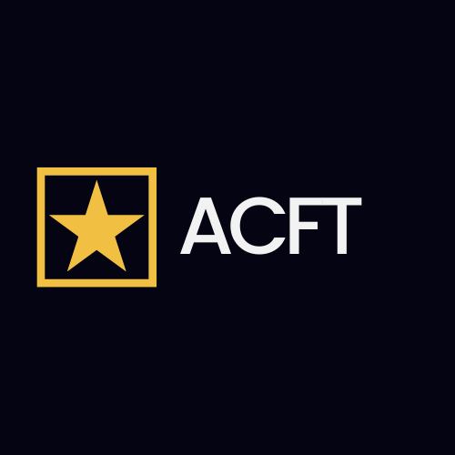
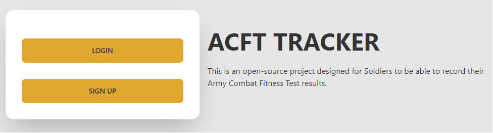

<a id='readme-top'></a>

<br />

<div align='center'>
  <a href='https://github.com/redconOne/acft-tracker'>
    
  </a>
  <h3 align='center'>
    Army Combat Fitness Test Tracker
  </h3>
  <p align='center'>
    A way to score and record your results from a US Army Physical Fitness Test
    <br />
    <a href='https://github.com/redconOne/acft-tracker'><strong>Explore the docs »</strong></a>
    <br /><br />
    <a href='https://acft-tracker.up.railway.app/'>View Live</a>
    |
    <a href='https://github.com/redconOne/acft-tracker/issues'>Report Bug</a>
    |
    <a href='https://github.com/redconOne/acft-tracker/issues'>Request Feature</a>
  </p>
</div>

<details>
  <summary>Table of Contents</summary>
  <ol>
    <li>
      <a href='#about'>About</a>
      <ul>
        <li>
          <a href='#built-with'>Built With</a>
        </li>
      </ul>
    </li>
    <li>
      <a href='#getting-started'>Getting Started</a>
      <ul>
        <li>
          <a href='#prerequisites'>Prerequisites</a>
        </li>
        <li>
          <a href='#installation'>Installation</a>
        </li>
      </ul>
    </li>
    <li>
      <a href='#usage'>Usage</a>
    </li>
    <li>
      <a href='#roadmap'>Roadmap</a>
    </li>
    <li>
      <a href='#optimizations'>Optimizations</a>
    </li>
    <li>
      <a href='#lessons-learned'>Lessons Learned</a>
    </li>
    <li>
      <a href='#contributing'>Contributing</a>
    </li>
    <li>
      <a href='#license'>License</a>
    </li>
    <li>
      <a href='#contact'>Contact</a>
    </li>
  </ol>
</details>

## About

<div align='center'>
  
</div>

<br />

<p>
  ACFT Tracker is a way for US Soldiers to score their tests and record the results. Results can be reviewed and edited later, and scoring is calculated live. 
</p>

### Built With


<p align='right'>
  (<a href='#readme-top'>back to top</a>)
</p>

## Getting Started

<p>
  To get the project running on your local machine you will require Node.js and the following instructions:
</p>

### Prerequisites


```sh
npm install npm@latest -g
```

### Installation

1. Sign up for your own SQL Database at [https://supabase.com](Supabase)
2. Clone the repo

```sh
git clone https://github.com/redconOne/acft-tracker.git
```

3. Install NPM packages

```sh
npm install
```

4. Enter your port, database string, and API keys in a `.env` file in base directory

```sh
PORT = 2121 (or a port of your choosing)
DB_STRING = your-DB-URI-here
```

5. Run in development environment

```sh
npm start
```

## Usage

- Sign up to get started.
- Start by selecting your identifying information
- Input test results for scoring

<p align='right'>
  (<a href='#readme-top'>back to top</a>)
</p>

## Roadmap

- [x] Include modals with exercise descriptions
- [ ] Further refine Records page
- [ ] Add settings page
- [ ] Add option to include subordinate scores

See the [open issues](https://github.com/redconOne/acft-tracker/issues) for a full list of proposed features (and known issues).

<p align='right'>
  (<a href='#readme-top'>back to top</a>)
</p>

## Optimizations

An update/refactoring of the Records page is currently in development, as well as a Settings page to adjust User Settings (like light/dark themes).
Planned future optimizations include ongoing improvements to user interface and navigation.

## Lessons Learned

I knew I wanted to maintain an MVC structure to maintain organization during development to allow future improvements or post-launch additions. New
Features can easily be worked into a new or existing model, followed by logic and data retrieval within the controllers(API).

It was import to work on creating a modern styling for this project, and I knew I was going to use TailwindCSS to achieve that result. I did lean
heavily on DaisyUI for components and addition UI support for a clean aesthetic and user-friendly experience.

A good portion of my owrk was spent researching package libraries' respective documentation to troubleshoot issues encountered along the way.

## Contributing

Feel free to join in! Whether its fixing bugs, improving documentation, or simply spreading the word! Please see
[Contributing Guidelines](/CONTRIBUTING.md) for futher guidance. If you require assistance please don't hesitate to reach out! Don't forget to give
the project a star!

## License

Distributed under MIT License. See [License](./LICENSE) for more information.

## Contact

<h3 align='center'>Ming Lee Ng</h3>
<h4 align='center'>
  <a href='https://twitter.com/MingLeeNg1'>Twitter</a>
  <a href='https://linkedin.com/in/MingLeeNg'>LinkedIn</a>
  <a href='https://minglee.me'>My Portfolio</a>
</h4>

Project Link: [ACFT-Tracker](https://acft-tracker.up.railway.app/)

<p align='right'>
  (<a href='#readme-top'>back to top</a>)
</p>
